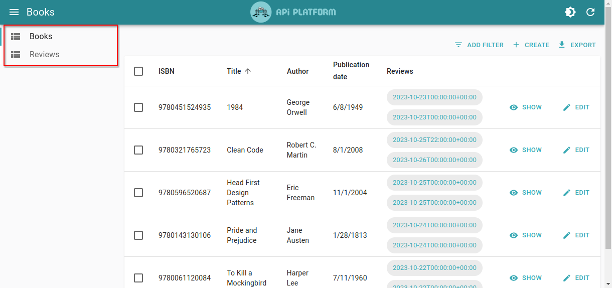

# Customizing the Guessers

Using `<HydraAdmin>` or `<OpenApiAdmin>` directly is a great way to quickly get started with API Platform Admin. They will introspect your API's schema and automatically generate CRUD pages for all the resources it exposes. They will even [configure filtering, sorting, and real-time updates with Mercure](./schema-org.md) if your API supports it.

For some this may be enough, but you will often find yourself wanting to customize the generated pages further. For instance, you may want to:

- Hide or reorder resources in the menu
- Hide or reorder columns in the list view
- Hide or reorder fields in the show view
- Hide or reorder inputs in the create and edit forms
- Customize the generated list, e.g. add a default sort order
- Customize the generated inputs, e.g. set a custom label or make a text input multiline

Such changes can't be achieved by modifying the Schema, they require customizing the React components generated by API Platform Admin.

Fortunately, API Platform Admin has you covered!

## From `<AdminGuesser>` To `<ResourceGuesser>`

If you are using `<HydraAdmin>` or `<OpenApiAdmin>` directly, there is a simple way to start customizing the generated pages.

Simply open your browser's developer tools and look at the console. You will see messages like this:

```
If you want to override at least one resource, paste this content in the <AdminGuesser> component of your app:

<ResourceGuesser name="books" />
<ResourceGuesser name="greetings" />
<ResourceGuesser name="reviews" />
```

This message tells you which resources are exposed by your API and how to customize the generated pages for each of them.

Let's say we'd like to hide the `greetings` resource from the menu. We can do this by replacing the `<AdminGuesser>` component (`<HydraAdmin>` in our case) children with a list of `<ResourceGuesser>`:

```diff
-import { HydraAdmin } from "@api-platform/admin";
+import { HydraAdmin, ResourceGuesser } from "@api-platform/admin";

const App = () => (
-   <HydraAdmin entrypoint={...} />
+   <HydraAdmin entrypoint={...}>
+       <ResourceGuesser name="books" />
+       <ResourceGuesser name="reviews" />
+   </HydraAdmin>
);
```

Now the `greetings` resource will no longer be displayed in the menu.



## ...

Customizing API Platform Admin is easy and idiomatic. The tool gives you the ability to customize everything, from the list of resource types that must be administrable to every single input or button.

To do so, you can use the React components provided by API Platform Admin itself, [React Admin](https://marmelab.com/react-admin/), [Material UI](https://material-ui.com/), [community libraries](https://github.com/brillout/awesome-react-components), or [write your own](https://reactjs.org/tutorial/tutorial.html).

## Customizing the Admin's Main Page and the Resource List

By default, API Platform Admin automatically builds a tailored [Resource component](https://marmelab.com/react-admin/Resource.html)
(and all its appropriate children) for each resource type exposed by a web API.
Under the hood it uses the `@api-platform/api-doc-parser` library to parse the API documentation.
The API documentation can use Hydra, OpenAPI and any other format supported by the library.
Resources are listed in the order they appear in the machine-readable documentation.

However, it's also possible to display only specific resources, and to order them, while still benefiting from all discovery features provided by API Platform Admin.
To cherry-pick the resources to make available through the admin, pass a list of `<ResourceGuesser>` components as children of the root component:

```javascript
import { HydraAdmin, ResourceGuesser } from '@api-platform/admin';

export default () => (
  <HydraAdmin entrypoint="https://demo.api-platform.com">
    <ResourceGuesser name="books" />
    <ResourceGuesser name="reviews" />

    {/* While deprecated resources are hidden by default, using an explicit ResourceGuesser component allows to add them back. */}
    <ResourceGuesser name="parchments" />
  </HydraAdmin>
);
```

Instead of using the `<ResourceGuesser>` component provided by API Platform Admin, you can also pass custom React Admin's [Resource components](https://marmelab.com/react-admin/Resource.html), or any other React components that are supported by React Admin's [Admin](https://marmelab.com/react-admin/Admin.html).

## Customizing the List View

The list view can be customized following the same pattern:

```javascript
import {
  HydraAdmin,
  ResourceGuesser,
  ListGuesser,
  FieldGuesser,
} from '@api-platform/admin';

const ReviewsList = (props) => (
  <ListGuesser {...props}>
    <FieldGuesser source="author" />
    <FieldGuesser source="book" />

    {/* While deprecated fields are hidden by default, using an explicit FieldGuesser component allows to add them back. */}
    <FieldGuesser source="letter" />
  </ListGuesser>
);

export default () => (
  <HydraAdmin entrypoint="https://demo.api-platform.com">
    <ResourceGuesser name="reviews" list={ReviewsList} />
    {/* ... */}
  </HydraAdmin>
);
```

In this example, only the fields `author`, `book` and `letter` (that is hidden by default because it is deprecated) will be displayed. The defined order will be respected.

In addition to the `<FieldGuesser>` component, [all React Admin Fields components](https://marmelab.com/react-admin/Fields.html) can be passed as children of `<ListGuesser>`.

## Customizing the Show View

For the show view:

```javascript
import {
  HydraAdmin,
  ResourceGuesser,
  ShowGuesser,
  FieldGuesser,
} from '@api-platform/admin';

const ReviewsShow = (props) => (
  <ShowGuesser {...props}>
    <FieldGuesser source="author" />
    <FieldGuesser source="book" />
    <FieldGuesser source="rating" />

    {/* While deprecated fields are hidden by default, using an explicit FieldGuesser component allows to add them back. */}
    <FieldGuesser source="letter" />

    <FieldGuesser source="body" />
    <FieldGuesser source="publicationDate" />
  </ShowGuesser>
);

export default () => (
  <HydraAdmin entrypoint="https://demo.api-platform.com">
    <ResourceGuesser name="reviews" show={ReviewsShow} />
    {/* ... */}
  </HydraAdmin>
);
```

In addition to the `<FieldGuesser>` component, [all React Admin Fields components](https://marmelab.com/react-admin/Fields.html) can be passed as children of `<ShowGuesser>`.

## Customizing the Create Form

Again, the same logic applies to forms. Here is how to customize the create form:

```javascript
import {
  HydraAdmin,
  ResourceGuesser,
  CreateGuesser,
  InputGuesser,
} from '@api-platform/admin';

const ReviewsCreate = (props) => (
  <CreateGuesser {...props}>
    <InputGuesser source="author" />
    <InputGuesser source="book" />
    <InputGuesser source="rating" />

    {/* While deprecated fields are hidden by default, using an explicit InputGuesser component allows to add them back. */}
    <InputGuesser source="letter" />

    <InputGuesser source="body" />
    <InputGuesser source="publicationDate" />
  </CreateGuesser>
);

export default () => (
  <HydraAdmin entrypoint="https://demo.api-platform.com">
    <ResourceGuesser name="reviews" create={ReviewsCreate} />
    {/* ... */}
  </HydraAdmin>
);
```

In addition to the `<InputGuesser>` component, [all React Admin Input components](https://marmelab.com/react-admin/Inputs.html) can be passed as children of `<CreateGuesser>`.

For instance, using an autocomplete input is straightforward, [check out the dedicated documentation entry](handling-relations.md#using-an-autocomplete-input-for-relations)!

## Customizing the Edit Form

Finally, you can customize the edit form the same way:

```javascript
import {
  HydraAdmin,
  ResourceGuesser,
  EditGuesser,
  InputGuesser,
} from '@api-platform/admin';

const ReviewsEdit = (props) => (
  <EditGuesser {...props}>
    <InputGuesser source="author" />
    <InputGuesser source="book" />
    <InputGuesser source="rating" />

    {/* While deprecated fields are hidden by default, using an explicit InputGuesser component allows to add them back. */}
    <InputGuesser source="letter" />

    <InputGuesser source="body" />
    <InputGuesser source="publicationDate" />
  </EditGuesser>
);

export default () => (
  <HydraAdmin entrypoint="https://demo.api-platform.com">
    <ResourceGuesser edit={ReviewsEdit} />
    {/* ... */}
  </HydraAdmin>
);
```

In addition to the `<InputGuesser>` component, [all React Admin Input components](https://marmelab.com/react-admin/Inputs.html) can be passed as children of `<EditGuesser>`.

For instance, using an autocomplete input is straightforward, [checkout the dedicated documentation entry](handling-relations.md#using-an-autocomplete-input-for-relations)!

## Going Further

API Platform is built on top of [React Admin](https://marmelab.com/react-admin/).
You can use all the features provided by the underlying library with API Platform Admin, including support for [authentication](https://marmelab.com/react-admin/Authentication.html), [authorization](https://marmelab.com/react-admin/Authorization.html) and deeper customization.

To learn more about these capabilities, refer to [the React Admin documentation](https://marmelab.com/react-admin/documentation.html).
